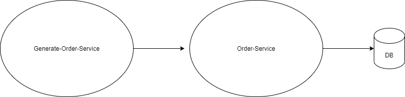
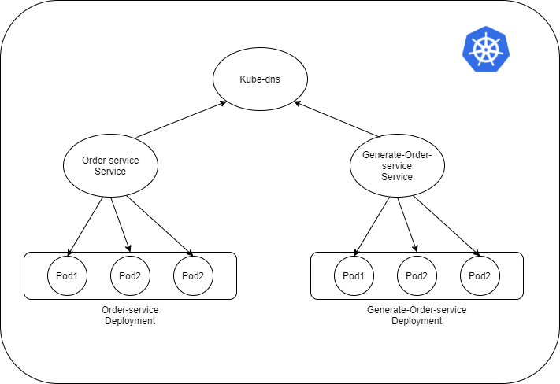

# [Frontend](https://github.com/ivanpang1996/pizza-joint/tree/main/frontend/README.md)
Please see the `frontend` dir.

# Backend

Pizza Joint have two services (generate-order-service & order-service).



`generate-order-service is a publisher and order-service is a consumer.`


The flow is simple. `generate-order-service ` keep generating orders (every 10 seconds or manual trigger the endpoint) and send those to `order-service` by using REST call. `order-service` is trying to save the orders to database. 

There are two ways to make two services talk to each other.
1. Docker compose
2. Kubernetes


### 1. Docker Compose
In this repo, I have included a `docker-compose.yml`. <br/>
First, you have to build the images for two services using the DockerFile provided in different directory.
```
gradlew build
docker build -t generate-order-service generate-order-service/.
docker build -t order-service order-service/.
docker-compose up
```
In the yml, I have created a local network. All the services within this local network can discovery and communicate with each other.<br/>
`order-service` have dependency on DB and `generate-order-serivce` have dependency on `order-service`.

### 2. Kubernetes
Kubernetes is a good way to do the service discovery. We need to create `deployment` & `service` two Kubernetes resource inside the cluster. Deployment don't have any connectivity in the beginning and Service is one to traffic down to the worker pod. <br/> `kube-dns` (or `core-dns` in AWS) is a default deployment can help to maintain the internal dns in the cluster. The service resource will help register the endpoint to the kube-dns resource (e.g. `<svc>.<ns>.svc.clusterset.local`). Each service can be discovered by each other using internal DNS.

Therefore, after created the cluster by (e.g. `minikube` & in the cloud provider), we only need to apply the yaml provided (`kubectl apply -f /kube`) to create Kubernetes resource. Kubernetes will help to do the rest.


If you need external access, you should create a load balancer and sit in front your service and attach your certificate on the loadbalancer. If you are using GCP, GCP is natively create a loadbalancer for you if you create an ingress resource. However, in AWS, remember to create a controller and grant a service account to the controller. The controller will help you create the alb when you are trying to create an ingress resource. 

Also, in order to keep the sensitive data secret, you can use a `secret` resource in Kubernetes. It will keep a key-value. Therefore, you can inject the env variable to your container by `valueFrom` (e.g. 04-order-service).