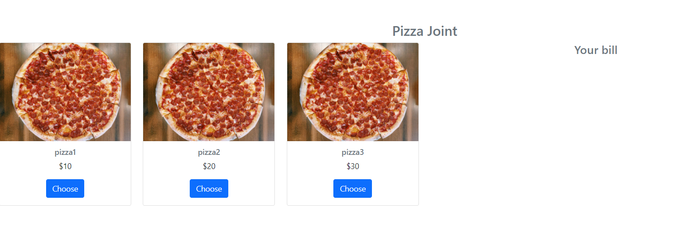
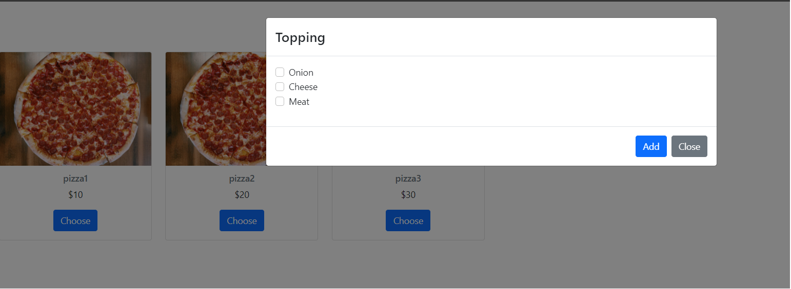
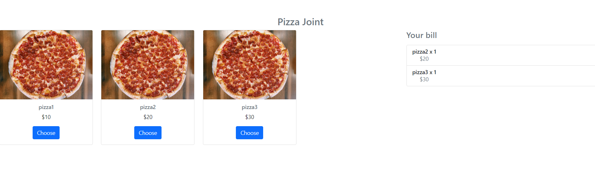

## How to run? 
Go the [pizza-joint](https://github.com/ivanpang1996/pizza-joint/tree/main/frontend/pizza-joint) dir and run by ` yarn start `.

## UI

When you click on the desired pizza, it will show a popup. You can add the pizza to the bill by clicking the `Add` button. The billing will show all the chosen pizzas

## Component

1. Pizza Card
2. Checkout
3. Modal

This demo is not fully finished. The `delete item` and `chosen topping` features are not implemented yet.